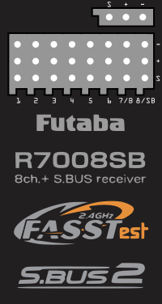

# R7008SB FASSTest Telemetry Receiver - Fritzing Part

## Introduction

[F7008SB](https://www.rc.futaba.co.jp/english/reciever/air00/r7008sb.html) is a telemetry receiver of Futaba Corporation.

I designed it as a Fritzing part.

You are free to use the FZPZ file.

## Screenshot

